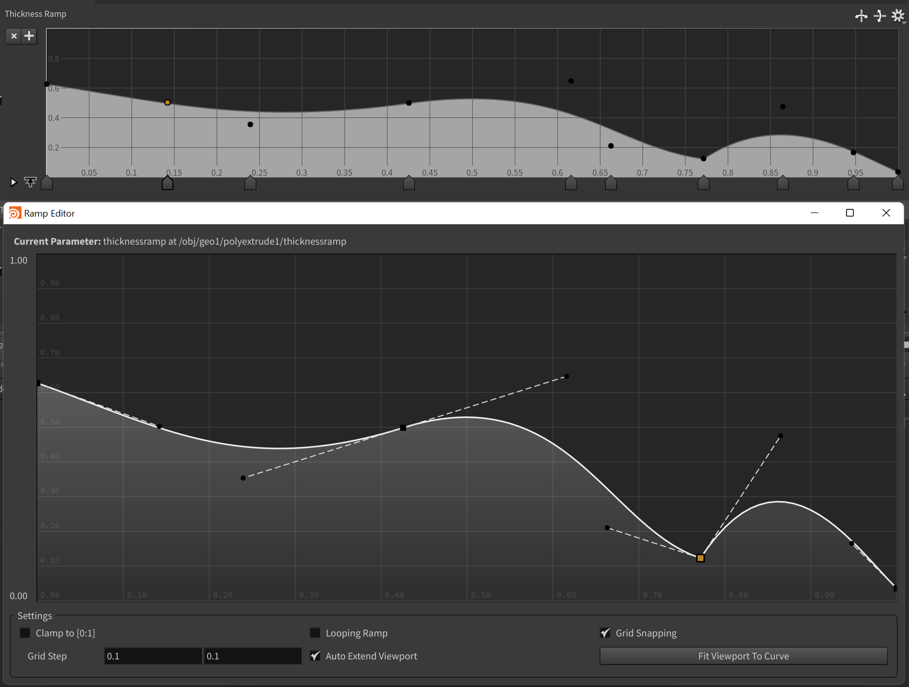
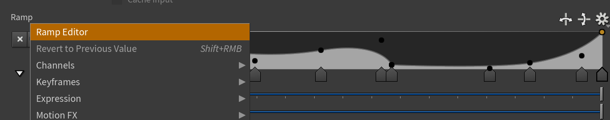

**DEPRECATED. Since Houdini 20.0 ramp editor natively supports this**

# Houdini Ramp Editor

Editor for Houdini float ramps parameters
Compatible with Houdini 19.5 Python 3.9 builds 

Features:
* Bezier controls for ramp editing
* Support for looping ramps
* Grid Snapping

## Installation

Install it as a usual houdini package.

To use the editor just right click on a ramp label.

## Help
* **Shift** + click on knot: add to selection
* **Delete**: delete selected knots
* **Shift** + moving control: make handles smooth
* **Control** + moving control: make handles broken
* **Double Click** on knot: make knot as corner or smooth

